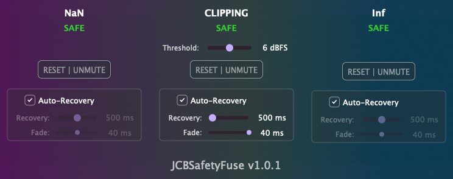

<p align="center">
  
</p>

Plugin de protección contra explosiones de señal (NaN, Inf y clipping extremo). Lo uso en los slots de entrada del software de control room para evitar problemas con un driver virtual concreto que ocasionalmente provoca estos fallos. Está hecho con Claude Code.

---

## Instalación (macOS)

1. Descarga el DMG desde la página de **Releases**.
2. Abre el DMG y ejecuta el instalador.
3. El instalador colocará los formatos de plugin seleccionados en las ubicaciones estándar de macOS:
    - VST3: `/Library/Audio/Plug-Ins/VST3/`
    - AU: `/Library/Audio/Plug-Ins/Components/`
    - AAX: `/Library/Application Support/Avid/Audio/Plug-Ins/`

*El DMG está firmado y notarizado para macOS.*

---

## Requisitos del sistema

- macOS 12.0 o posterior
- Procesador Intel o Apple Silicon
- DAW compatible con VST3, AU o AAX
- Host con capacidad multicanal (hasta 7.1)

---

## Compilación desde código fuente

### Prerrequisitos

- Git
- CMake 3.20 o posterior
- Apple Clang con soporte C++20 (Xcode 13 o posterior)
- JUCE 8.0.8 (descargado automáticamente mediante FetchContent)
- **AAX SDK** (solo requerido para compilar el formato AAX)

### Instrucciones de compilación

1. Clona el repositorio:
```bash
git clone https://github.com/cjitter/JCBSafetyFuse.git
cd JCBSafetyFuse
```

2. Configura el proyecto:
```bash
# Debug
cmake -B build-debug -DCMAKE_BUILD_TYPE=Debug

# Release
cmake -B build-release -DCMAKE_BUILD_TYPE=Release

# Con soporte AAX
cmake -B build-release -DCMAKE_BUILD_TYPE=Release -DJUCE_BUILD_AAX=ON
```

3. Compila:
```bash
cmake --build build-debug
cmake --build build-release
```

---

## Características

- Detecta y sanitiza (pone a 0) NaN, Inf y explosiones de nivel
- Tres sistemas independientes con auto-recovery configurable
- Fade-out/in suave para evitar clicks (0-40ms)
- Soporta hasta 8 canales (mono a 7.1)
- Latencia cero, sin asignaciones de memoria en el hilo de audio

---

## Cuándo puede ser útil

- Protección contra bugs en plugins o drivers de audio
- Experimentación con código DSP propio o cadenas de procesamiento complejas

---

© 2025 Juan Carlos Blancas – JCBSafetyFuse 1.0.1
